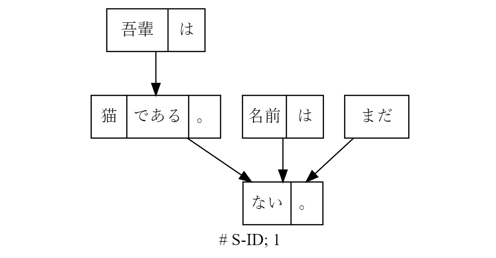

# jdepp-python

<div align="center">
  
</div>

Python binding for J.DepP(C++ implementation of Japanese Dependency Parsers) https://www.tkl.iis.u-tokyo.ac.jp/~ynaga/jdepp/

## Install

```
$ python -m pip install jdepp
```

### Precompiled model files

pip install does not install the model(dictionary).

You can get precompiled model files(MeCab POS tagging + train with KNBC copus) from

https://github.com/lighttransport/jdepp-python/releases/tag/v0.1.0

Precompiled KNBC model file is licensed under 3-clause BSD license.

### Build configuration

* MeCab style POS format: `FEATURE_SEP ','`
* See `jdepp/typedf.h` for more info about ifdef macros.

## Example

Download precompiled model file.

```bash
$ wget https://github.com/lighttransport/jdepp-python/releases/download/v0.1.0/knbc-mecab-jumandic-2ndpoly.tar.gz
$ tar xvf knbc-mecab-jumandic-2ndpoly.tar.gz
```

```py
import jdepp

model_path = "model/knbc"

parser = jdepp.Jdepp()
parser.load_model(model_path)

# NOTE: Mecab format: surface + TAB + feature(comma separated 7 fields)
input_postagged = """吾輩	名詞,普通名詞,*,*,吾輩,わがはい,代表表記:我が輩/わがはい カテゴリ:人
は	助詞,副助詞,*,*,は,は,*
猫	名詞,普通名詞,*,*,猫,ねこ,*
である	判定詞,*,判定詞,デアル列基本形,だ,である,*
。	特殊,句点,*,*,。,。,*
名前	名詞,普通名詞,*,*,名前,なまえ,*
は	助詞,副助詞,*,*,は,は,*
まだ	副詞,*,*,*,まだ,まだ,*
ない	形容詞,*,イ形容詞アウオ段,基本形,ない,ない,*
。	特殊,句点,*,*,。,。,*
EOS
"""

sent = parser.parse_from_postagged(input_postagged)
print(sent)
```

### Print in tree

```py
print(jdepp.to_tree(str(sent)))
```

```
# S-ID: 1; J.DepP
  0:　　吾輩は━━┓　　　
  1:　　　猫である。━━┓
  2:　　　　　名前は━━┫
  3:　　　　　　まだ━━┫
  4:　　　　　　　　ない。EOS
```

### Graphviz dot export


`jdepp.to_dot` is provided to export graph as dot(Graphviz)

```py
dot_text = jdepp.to_dot(str(sentence))

# feed output text to graphviz viewer, e.g. https://dreampuf.github.io/GraphvizOnline/
```

<div align="center">
  
</div>

See [examples/](examples) for more details

## POS tagged input format

MeCab style. surface + TAB + feature(comma separated 7 fields)

### With jagger

You can use jagger-python for POS tagging.

```py
import jagger
import jdepp

jagger_model_path = "model/kwdlc/patterns"
tokenizer = jagger.Jagger()
tokenizer.load_model(jagger_model_path)

text = "吾輩は猫である。名前はまだない。"
toks = tokenizer.tokenize(text)

pos_tagged_input = ""
for tok in toks:
    pos_tagged_input += tok.surface() + '\t' + tok.feature() + '\n'
pos_tagged_input += "EOS\n"


jdepp_model_path = "model/knbc"
parser.load_model(jdepp_model_path)

parser.parse_from_postagged(pos_tagged_input)
```


## Build standalone C++ app + training a model

If you just want to use J.DepP from cli(e.g. batch processing),
you can build a standalone C++ app using CMake.

We modified J.DepP source code to improve portablily(e.g. Ours works well on Windows)

Training a model from Python binding is also not yet supported.
For a while, you can train a model by using standalone C++ jdepp app.

### Standalone python module(For developer)

This is for developer usecase.
Use setup.py(pyproject.toml) to build python module for end users.

Install pybind11 devkit.

```
$ python -m pip install pybind11
```

Then invoke cmake with `-DJDEPP_WITH_PYTHON` and `pybind11_DIR`

```
$ pybind11_DIR=/path/to/pybind11 cmake -DJDEPP_WITH_PYTHON=1 ...
```


### Releasing

* tag it: `git tag vX.Y.Z`
* push tag: `git push --tags`

Versioning is automatically done through `setuptools_scm`

## TODO

- [ ] WASM build
- [ ] Training API support
- [ ] Integrate jagger POS tagger as builtin(standalone) POS tagger in J.DepP
  - https://github.com/lighttransport/jagger-python
- [ ] MMap(or SharedMemory) load of dict data to save memory in Python multiprocessing

## License

jdepp-python is licensed under 2-Clause BSD license.

J.DepP https://www.tkl.iis.u-tokyo.ac.jp/~ynaga/jdepp/ is licensed under GPLv2/LGPLv2.1/BSD triple license.

## Thrird party license

* pacco, cedar, opal(subcompoennts of J.DepP): GPLv2/LGPLv2.1/BSD triple license. We choose BSD license.
* io-util: MIT license.
* optparse: Unlicense https://github.com/skeeto/optparse
